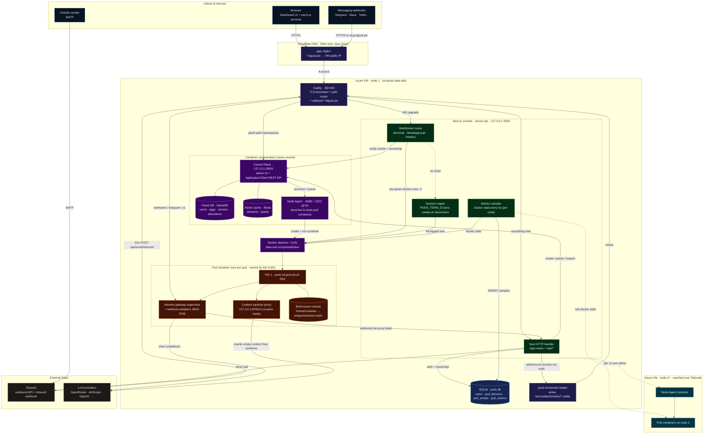
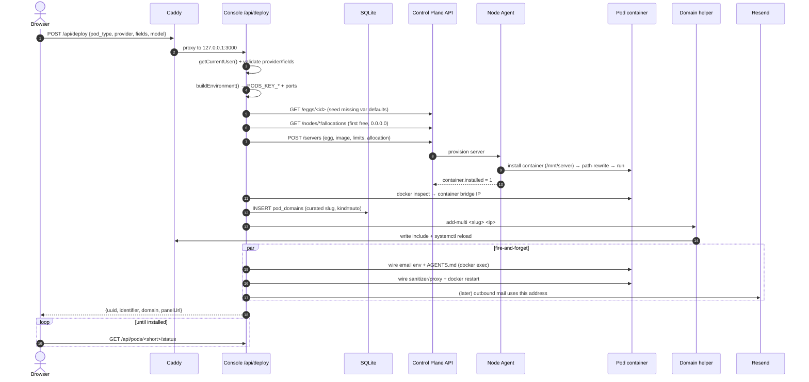
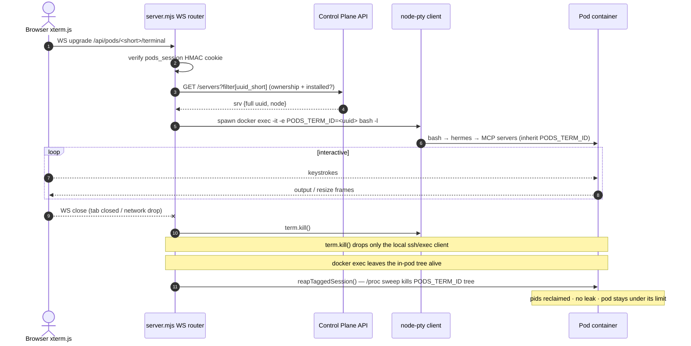

# FuelBorn — End-to-End Architecture

One-click deployment platform for AI agents, sandboxes, automation, and game servers. Pelican Panel + Wings (a Pterodactyl fork) under the hood, wrapped by a custom Next.js console that owns auth, deploy orchestration, per-pod subdomains, an in-pod content sanitizer, a managed email mailbox per pod, an in-browser PTY terminal, and a live `docker stats` metrics pipe.

This document is the single source of truth for *what runs where* and *how a request flows from a browser click all the way down to a docker container*.

---

## 0. Table of contents

1. Product surface — what the user gets
2. Physical layout — one Azure VM, what's on it
3. Containers and host services
4. Network ingress (Caddy + Cloudflare wildcard)
5. Data plane (SQLite, Pelican MariaDB+Redis, named volumes)
6. The Next.js console (`frontend/`)
7. Custom server.mjs — WebSocket terminal + metrics
8. Authentication and authorization
9. Pod types and the egg system
10. Pod lifecycle — deploy → install → run → delete
11. The sandbox-ubuntu image and PID 1 supervisor
12. Per-pod subdomains and webhook fan-out
13. Managed email per pod (Resend integration)
14. The in-pod content sanitizer proxy
15. LLM providers and connectors catalogs
16. Skills, MCP, persona, file system tabs
17. Landing site (`landing/`)
18. Bring-up and deploy
19. Known footguns

---

## 1. Product surface

The marketing pitch from `README.md` and the landing site:

> "One-click deployment platform for AI agents, sandboxes, and game servers. Pick a template, hit deploy, get a URL."

Today four pod types are wired up via the registry in `frontend/src/lib/pod-types.ts`:

| Slug | Kind | Image | Defaults | Surface |
|---|---|---|---|---|
| `hermes` | agent | `pods-ml/sandbox-ubuntu:1.0` | 4 GB RAM, 15 GB disk, 100 % CPU | HTTPS on :8080 + Caddy path-routed webhook ports |
| `n8n` | automation | `ghcr.io/pelican-eggs/yolks:nodejs_22` | 2 GB RAM, 8 GB disk | HTTPS on :5678 (n8n editor + webhooks) |
| `code-sandbox` | sandbox | `pods-ml/sandbox-ubuntu:1.0` | 4 GB RAM, 20 GB disk | HTTPS on :8080 (flavor: `code-server` / `claude-code` / `plain`) |
| `minecraft-paper` | game | `ghcr.io/pterodactyl/yolks:java_21` | 4 GB RAM, 10 GB disk, 200 % CPU | TCP :25565 (Minecraft) |

Hermes is the implicit default — a deploy without `pod_type` lands on Hermes. The frontend renders different tabs per pod type (`showConnectors`, `showProviders`, per-type panels for Skills / MCP / Persona / Minecraft / Email / Files).

---

## 2. Physical layout

One Azure VM hosts everything in the prototype:

```
Resource group   : pods-ml-prototype
Region           : eastus
Size             : Standard_D4s_v5 (4 vCPU, 16 GiB)
Image            : Ubuntu 22.04 LTS
Public IP        : 172.174.92.191 (Standard SKU, DNS-only on the FQDN)
FQDN             : pods-ml-prototype.eastus.cloudapp.azure.com
Wildcard domain  : *.bigcat.pw → same IP, Cloudflare DNS-only
Admin user       : podsadmin
OS disk          : 64 GB Premium_LRS
Data disk        : 128 GB Premium_LRS, mounted at /srv/pods
```

Provisioning is captured in `infra/azure-provision.sh` — creates the RG, NSG, public IP, VM, and attaches the data disk. The NSG opens 22 (SSH), 80/443 (Caddy), 8080 + 2022 (Wings panel-link + SFTP), and 1024-65535 (legacy from when Wings used host port-binds; container traffic now goes through the docker bridge so most of this isn't strictly needed).

`infra/scripts/bootstrap.sh` runs once on the fresh VM to mount the data disk, install Docker, point Docker's data-root at `/srv/pods/docker`, lay down the Pelican compose stack, install the Wings binary, and install Node.js 20 LTS + pnpm. The compose stack and Wings come up but Wings is not enabled until you generate its `config.yml` from the Pelican panel.

Persistent data layout on the data disk:

```
/srv/pods/
├── docker/                       Docker data-root (overlayfs, volumes, etc.)
├── pelican/
│   ├── compose.yml               infra/pelican/compose.yml mirror
│   ├── .env                      MYSQL_*, APP_URL, LE_EMAIL (mode 600)
│   ├── data/   db/   logs/       (legacy; named-volume drives the live data)
├── wings/volumes/<full-uuid>/    Per-pod persistent volume (mounted at /home/container)
├── frontend/                     The Next.js app
│   └── data/pods.db              SQLite (WAL + WAL-SHM in this git tree are runtime artifacts)
├── eggs/                         Imported egg JSON copies
└── images/sandbox-ubuntu/        Source for the custom docker image
```

---

## 3. Containers and host services

Host-level processes (run by systemd, not docker):

| Service | Listens on | Unit / install path | Purpose |
|---|---|---|---|
| `caddy.service` | :80, :443 | `/etc/caddy/Caddyfile` (custom xcaddy build with `caddy-dns/cloudflare`) | TLS terminator — routes panel paths to the panel container and everything else to Next.js; also serves the `*.bigcat.pw` wildcard |
| `pods-ml-frontend.service` | 127.0.0.1:3000 | `infra/scripts/frontend.service` → `/etc/systemd/system/` | Runs `pnpm start` = `node server.mjs`. Runs as `podsadmin` with `SupplementaryGroups=docker` so it can `docker exec` |
| `wings.service` | 127.0.0.1:8080 (panel ↔ wings) and :2022 SFTP | `infra/wings/wings.service` | Per-node Pelican daemon: launches/stops pod containers, reads `/etc/pelican/config.yml`. Ordered `After=docker.service lxcfs.service` |
| `lxcfs.service` | FUSE under `/var/lib/lxcfs/proc/*` | apt-installed | Virtualises `/proc` so containers see cgroup-correct memory/CPU |
| `docker.service` | unix socket | distro | Container runtime. `data-root` overridden to `/srv/pods/docker` |
| `sync-cert.sh` (daily cron) | n/a | `/usr/local/sbin/sync-cert.sh` | Exports the Caddy-managed Let's Encrypt cert to `/etc/letsencrypt/live/<fqdn>/` so Wings (which expects on-disk PEMs) sees the same cert. Restarts Wings only when content changes |

Containers managed by docker compose (`infra/pelican/compose.yml`):

| Container | Image | Role |
|---|---|---|
| `pelican-panel-1` | `ghcr.io/pelican-dev/panel:latest` | Pelican (Laravel+Filament) admin UI + REST API. Listens on `127.0.0.1:8000`. `BEHIND_PROXY=true`, `TRUSTED_PROXIES=127.0.0.1,172.17.0.1,…` so X-Forwarded-* from host Caddy is honoured |
| `pelican-database-1` | `mariadb:10.11` | Panel DB (`panel` schema). `pelican` user, named volume `pelican-db` |
| `pelican-cache-1` | `redis:alpine` | Cache + sessions + queue for Pelican (`CACHE_STORE=redis`, `SESSION_DRIVER=redis`, `QUEUE_CONNECTION=redis`) |

Containers managed by Wings (one per pod): named after the pod's full UUID (e.g. `dda6ff66-6214-4d49-8d34-af22b69099c9`). Image is one of the per-type defaults above. Wings bind-mounts `/srv/pods/wings/volumes/<full-uuid>/` to `/home/container/`, plus the seven `/var/lib/lxcfs/proc/*` FUSE files via Pelican's mount mechanism (mount IDs `1,2,3,4,5,6,7` in `PODS_LXCFS_MOUNT_IDS`).

---

## 4. Network ingress

Single TLS terminator on the host (Caddy). Three independent virtual hosts coexist in `infra/caddy/Caddyfile`:

```
{$APP_HOST}          (pods-ml-prototype.eastus.cloudapp.azure.com)
*.bigcat.pw          (wildcard cert, per-pod subdomains)
```

**Host FQDN block:**
- A `@panel` matcher pulls the Pelican path namespaces (`/admin`, `/api/application`, `/api/client`, `/api/remote`, `/livewire`, `/filament`, `/storage`, `/vendor`, `/webhook`, `/up`, `/assets`, etc.) and reverse-proxies them to `127.0.0.1:8000` (panel container) with `X-Forwarded-Host` + `X-Real-IP` headers.
- The fall-through `handle` proxies everything else to `127.0.0.1:3000` (Next.js).
- Important: our own routes `/api/auth/*`, `/api/deploy`, `/api/models`, `/api/pods/*`, `/api/domains/*`, `/api/email/inbound` are NOT in the panel matcher → they hit Next.js as intended.

**Wildcard block (`*.bigcat.pw`):**
- TLS via Cloudflare DNS-01 (token at `/etc/caddy/cloudflare.env`, drop-in `EnvironmentFile` in `/etc/systemd/system/caddy.service.d/cloudflare.conf`).
- `import /etc/caddy/domains/*.caddy` pulls in per-pod include files written by the `pods-ml-domain` helper.
- Default fall-through: a friendly 404 ("this domain is not mapped to a container yet").
- Shared rotating JSON access log at `/var/log/caddy/pods/access.log` (50 MB × 4 files, 168 h retention) — the Next.js Webhook Events Inspector tails this and filters by request host to show per-pod webhook traffic.

**The `pods-ml-domain` helper** (`infra/scripts/pods-ml-domain`, sudoers-NOPASSWD for `podsadmin`):

```
pods-ml-domain add        <slug> <ip> <port>      single-port reverse proxy
pods-ml-domain add-multi  <slug> <ip>             path-routed include (Hermes auto-domain)
pods-ml-domain remove     <slug>                   delete + reload
```

- Slug validated against DNS label regex; IP must be in `172.16.0.0/12` (docker bridge range); port 1-65535.
- `add-multi` writes a path-routed include with fixed port pins for every Hermes platform adapter:

  | Path | Port | Adapter |
  |---|---|---|
  | `/webhooks/twilio*` | 8643 | Twilio SMS (matched before generic /webhooks) |
  | `/webhooks/*` | 8644 | Generic Hermes webhook adapter |
  | `/v1/*` | 8642 | Hermes OpenAI-compatible API |
  | `/telegram/*` | 8443 | Telegram webhook |
  | `/msgraph/*` | 8646 | Microsoft Graph |
  | `/wecom/*` | 8645 | WeCom |
  | `/feishu/*` | 8765 | Feishu |
  | `/bluebubbles/*` | 8649 | BlueBubbles |
  | `/line/*` | 8647 | LINE |
  | `/teams/*` | 3978 | Bot Framework (`handle_path` strips the prefix) |
  | else | 8080 | User's freeform web app |

- After writing the file, `systemctl reload caddy`.

**Cloudflare DNS** at `bigcat.pw`:
- `A *  → 172.174.92.191` (DNS only, gray cloud — orange/proxy mode would intercept TLS and break wildcard issuance)
- `A app → 172.174.92.191` (DNS only)

---

## 5. Data plane

Three data stores:

### 5.1 Pelican panel DB
- MariaDB inside the `pelican-database-1` container, volume `pelican-db`.
- Owns: users (Pelican accounts), nodes, eggs and their variables, servers (= pods), allocations, mounts, ApiKey rows (both `TYPE_APPLICATION` admin keys and per-user `TYPE_ACCOUNT` client keys).

### 5.2 Pelican Redis cache
- `pelican-cache-1` container. Holds Laravel sessions, the queue, and the cache backend. No persistent state we depend on.

### 5.3 Frontend SQLite — `frontend/data/pods.db`
- `better-sqlite3`, WAL mode, file lives on the data disk.
- Schemas are created idempotently in **both** `frontend/server.mjs` and `frontend/src/lib/db.ts` (production and dev/route-handler isolation cases respectively).
- Forward-compatible `ALTER TABLE … ADD COLUMN` on boot for newer columns (`email_verified_at`, `pod_email_token`).

Tables:

| Table | Purpose |
|---|---|
| `users` | Local auth: email, bcrypt hash, Pelican user id, Pelican client (account) token, `email_verified_at` |
| `pending_signups` | Email + bcrypt hash + OTP hash for users who started signup but haven't verified |
| `password_reset_codes` | One unconsumed reset OTP per user; auto-overwrites on resend |
| `pod_domains` | Slug → (pod uuid_short, full uuid, port, user, container_ip, kind=auto/manual, pod_email_token, created_at) — source of truth for Caddy includes |
| `pod_emails` | All inbound + outbound mail tied to a pod (`direction`, `from`, `to`, `subject`, `text`, `html`, `headers_json`, `in_reply_to`, `message_id`, `received_at`/`sent_at`, `error`); unique on `resend_email_id` for inbound idempotency |
| `pod_metrics` | Rolling 24h docker-stats samples at 5s cadence (`cpu`, `mem_mb`, `mem_pct`, `net_rx_mb`, `net_tx_mb`, `blk_rd_mb`, `blk_wr_mb`); primary key `(uuid_short, ts)`; retention sweep every minute |

---

## 6. The Next.js console

`frontend/` is a Next.js 16 + React 19 + Tailwind 4 app with a custom Node server. The router uses route groups:

```
src/app/
├── layout.tsx                global head + fonts (Manrope / JetBrains Mono / Rubik Mono One)
├── (app)/                    authenticated app shell
│   ├── layout.tsx            (renders the sidebar/topbar via /components/app-shell)
│   ├── page.tsx              "/" — either dashboard (logged in) or LandingPage (anon)
│   ├── pods/                 listing + /pods/[uuid] pod detail (tabs)
│   ├── deploy/               new-pod wizard
│   ├── domains/              cross-pod domains manager
│   ├── account/   billing/   account + billing pages
├── (auth)/                   login / signup / verify-email / forgot-password / reset-password
└── api/
    ├── auth/                 login, signup, OTP verify, resend OTP, password reset, logout
    ├── deploy                POST → provision a pod (the orchestration centerpiece)
    ├── models                GET → OpenAI-compatible /v1/models proxy for the provider picker
    ├── domains, domains/[slug]                 cross-pod domain CRUD
    ├── email/inbound          Resend webhook (Svix-verified) for inbound mail
    └── pods/[uuid]/
        ├── route.ts          DELETE pod
        ├── status, dashboard, allocation       overview reads
        ├── provider          POST switch LLM provider on a running pod
        ├── connectors, connectors/[platform]   token-driven messaging connectors
        ├── whatsapp, whatsapp/session          QR pairing + session status
        ├── mcp, persona, tools                 MCP servers, SOUL.md, tool list
        ├── skills, skills/{browse,inspect,refresh}  skill registry
        ├── domains                              per-pod domain mgmt
        ├── email/{messages,send}                managed mailbox
        ├── fs/{list,file}                        File browser tab
        ├── minecraft/{version,properties,plugins} Paper-specific tabs
        ├── metrics-history                      SQLite-backed history series
        ├── power                                 start/stop/restart/kill
        ├── webhooks/events                       per-pod webhook tail of Caddy access log
        └── ws-token                              short-lived signed token for WebSocket auth
```

The lib layer (`src/lib/`) is the back end:

| File | Purpose |
|---|---|
| `auth.ts` | Email/password + OTP signup/login + password reset. Creates the matched **Pelican user** + mints a per-user `TYPE_ACCOUNT` ApiKey via `docker exec pelican-panel-1 php artisan tinker` (no REST endpoint exists for client-token minting) |
| `session.ts` | HMAC-signed `pods_session` and `pods_reset` cookies (7d / 5min). Uses `SESSION_SECRET` |
| `db.ts` | SQLite schema + types + a Proxy that defers DB open until first use |
| `pelican.ts` | `applicationApi<T>()` JSON wrapper around the Pelican Application API; `findPelicanUserByEmail`; `ServerAttributes` type |
| `pods.ts` | `listMyPods()` — filters `/api/application/servers` by `attributes.user === pelicanUserId` |
| `providers.ts` | 30+ LLM provider catalog (recommended/popular/regional/local/enterprise/experimental/custom). Each entry has fields, optional `modelsEndpoint`, `mode` (key/oauth/cli/cloud) |
| `connectors.ts` | Messaging connector catalog: Telegram/Discord/Slack/Mattermost/Matrix/Google Chat/Feishu/WeCom/DingTalk/QQ/Yuanbao/Home Assistant/Open WebUI/Email/Signal/WhatsApp/BlueBubbles/etc. Each has `kind=token\|oauth\|infra`, `fields[]`, optional `webhookPath` + `webhookUrlEnv` + `staticEnv` |
| `pod-types.ts` | The four pod types and their resource defaults |
| `pod-config.ts` | `writeEnv()`, `patchConfigYaml()`, `restartGateway()`, `whatsappPaired()` — docker-exec helpers for in-pod state |
| `sanitizer.ts` | Helpers to ship `sanitizer.py` + `sanitizer.sh` + `pods-ml-pod-init.sh` into a pod and (re)start the in-pod content sanitizer proxy |
| `domains.ts` | Slug pool (curated single-word names: juno, atlas, lyra, …), `generateUniqueSlug()`, `getContainerIp()`, `addCaddyDomain[Multi]()`, `removeCaddyDomain()`, `WEBHOOK_URL_PATHS` mirroring the Caddy helper |
| `persona.ts` | SOUL.md / AGENTS.md authoring; `installEnvAutoSource()` (auto-export `~/.hermes/.env` into every bash shell); `disableBuiltinSkills(['himalaya'])` |
| `hermes-skills.ts` | Filesystem walk over `~/.hermes/skills/<cat>/<name>/SKILL.md` and Hermes' own browse-index cache; install/uninstall via the hermes CLI |
| `mcp-catalog.ts` | Curated catalog of MCP servers the user can wire into Hermes |
| `minecraft.ts`, `minecraft-properties.ts` | Helpers for the Paper pod type (version pinning, server.properties editor) |
| `resend.ts` | Resend SDK wrapper: `sendEmail()`, `fetchReceivedEmail(id)`, `verifyInboundWebhook()` (Svix HMAC), `slugFromAddress()`, `podAddressFor(slug)` |
| `auth-emails.ts` | OTP email templates sent via Resend |
| `otp.ts`, `validation.ts`, `cn.ts` | utilities |

Components (`src/components/`):
- `app-shell/` (sidebar + topbar + index)
- `landing/` (hero, how-it-works, pod-family, why-pods, footer CTA — re-rendered on `/` for logged-out visitors)
- `ui/` (badge, button, card, empty, input, keycap, select, sheet, skeleton, stepper, tabs)
- top-level: `auth-card`, `auth-shell`, `brand-icon`, `command-palette`, `deploy-hub`, `deploy-wizard`, `glyph-field`, `otp-input`, `top-nav`

Per-pod page components (`src/app/(app)/pods/[uuid]/`):
- `PodPageClient.tsx` — top-level tabbed shell
- `DashboardTab.tsx`, `PodMetrics.tsx`, `PodConsole.tsx`, `PodShell.tsx`, `PodActions.tsx`
- `ProviderSettings.tsx`, `ProvidersTab.tsx`, `PersonaTab.tsx`, `SkillsTab.tsx`, `McpTab.tsx`
- `ConnectorsTab.tsx`, `ConnectorCard.tsx`, `ConnectorPickerSheet.tsx`, `ConfiguredConnectorCard.tsx`, `OAuthHandoffCard.tsx`, `ConnectInfoCard.tsx`, `InfraTodoCard.tsx`
- `WhatsAppConnector.tsx`, `WhatsAppPairing.tsx` (PTY-driven QR pairing flow)
- `DomainsTab.tsx`, `FilesTab.tsx`, `EmailTab.tsx`, `MinecraftTab.tsx`, `WebhookEventsLog.tsx`

---

## 7. Custom `server.mjs`

`pnpm start` runs `node server.mjs`, not `next start`. The custom server:

1. **HTTP** — wraps Next's request handler in a `node:http` server.
2. **WebSocket router** for three upgrade paths:
   - `/api/pods/<uuid_short>/terminal` → spawns `docker exec -it -e TERM=xterm-256color -e COLORTERM=truecolor -e PODS_ML_MOTD_SHOWN=1 <full-uuid> /bin/bash -l` via `node-pty`. Forwards bytes both ways. Handles a `{"r": [cols, rows]}` JSON resize frame. **Node-aware:** for a pod on a remote Wings node it spawns `ssh -tt <tailnet-ip> docker exec -i …` instead (the `dockerInvocation` helper — a plain-JS mirror of `src/lib/node-exec.ts`, since `server.mjs` runs unbundled and can't import the TS module).
   - `/api/pods/<uuid_short>/whatsapp-pair` → same shape, but the spawn command is the Hermes WhatsApp pairing wizard. Has an inline bootstrap that checks for `node_modules/@whiskeysockets/baileys/lib/index.js` (the package's actual main entry — earlier the canary was wrong and every click reinstalled).
   - `/api/pods/<uuid_short>/metrics` → subscribes the websocket to the global metrics broadcaster (no per-WS docker process).
3. **Auth on every upgrade** — re-verifies the `pods_session` HMAC cookie against `users` in SQLite, then calls Pelican's `GET /api/application/servers?filter[uuid_short]=…` to confirm the user owns the pod (`srv.user === user.pelican_user_id`) AND that `srv.container.installed === 1` before opening the PTY.
4. **Background metrics sampler** — every 5 s runs `docker stats --no-stream --format '{json}'`, filters for container names matching the full-UUID shape (skipping `pelican-panel-1` etc.), parses CPU%/mem/net/blk, INSERTs into `pod_metrics`, and broadcasts to live WebSocket subscribers. Retention sweep every minute removes rows older than 24 h. **Node-aware:** the sampler runs one `docker stats` per node — the local daemon plus an `ssh <tailnet-ip> docker stats` for every node in `PELICAN_NODE_TAILSCALE_IPS` — and merges the lines, so node-2+ pods show up in Stats too.

The systemd unit (`infra/scripts/frontend.service`) runs the process as `podsadmin`, `SupplementaryGroups=docker` — that's how the Node process can call `docker exec` without sudo.

---

## 8. Auth and authorization

Two cookie types, both HMAC-signed with `SESSION_SECRET`:
- `pods_session` (7 d, lax, httpOnly, secure in prod) → `{ uid, iat }`
- `pods_reset` (5 min) → `{ uid, iat, scope:"reset" }` set after OTP-verify on the password reset flow

`src/middleware.ts` is a thin gate:
- `/`, `/login`, `/signup`, `/forgot-password`, `/reset-password`, `/verify-email` are public.
- `/api/auth/*`, `/api/email/inbound`, and `/_next/*` are public.
- `/api/pods/<uuid>/email/send` is **bearer-allowed**: middleware lets through `Authorization: Bearer …` requests without a cookie, and the route handler validates the token against `pod_domains.pod_email_token`. This is how the pod calls back into FuelBorn from inside the container.
- Everything else requires `pods_session` to be present. Real session verification is in route handlers via `getCurrentUser()` (`src/lib/auth.ts`), because middleware can't open SQLite (Edge runtime).

**Signup flow:**
1. Client POSTs email + password to `/api/auth/signup` → row added to `pending_signups` with bcrypt hash + OTP hash + 24 h expiry. OTP email sent via Resend (`sendSignupOtpEmail`).
2. Client POSTs `{ email, code }` to `/api/auth/verify-otp`. On success:
   - `createPelicanUserAndToken(email, randomThrowawayPassword)`:
     - `POST /api/application/users` (admin token) — handles 422 "email already taken" by looking up the existing id (covers retry after a partial failure).
     - `mintPelicanClientToken(pelicanUserId)` — shells out to `docker exec pelican-panel-1 php artisan tinker --execute="App\Models\ApiKey::create(['key_type' => TYPE_ACCOUNT, …])"`. Optionally via SSH if `PELICAN_SSH_HOST` is set, for laptop dev.
   - INSERT into `users` (id, email, password_hash, pelican_user_id, pelican_client_token, email_verified_at=now()).
   - DELETE the `pending_signups` row.
   - Drop the `pods_session` cookie via `setSession(userId)`.
3. Login (`/api/auth/login`) is a straight bcrypt compare + `email_verified_at IS NOT NULL` check.
4. Password reset is the same OTP machinery but emits a short-lived `pods_reset` cookie after OTP verify; the `/api/auth/reset-password` endpoint then trusts that cookie to allow setting the new password.

Per-pod ownership: every per-pod API route resolves the pod via `applicationApi('/servers?filter[uuid_short]=…')` and rejects if `srv.user !== currentUser.pelicanUserId`.

---

## 9. Pod types and the egg system

Each pod type maps to a Pelican **egg** (= install script + variable declaration + docker image). Eggs live in `eggs/`:

- `eggs/hermes-agent.json` — Nous Research Hermes Agent. Install script:
  1. apt-installs curl/ca-certs/git/build-essential into the install container.
  2. `mkdir /mnt/server/{,.tmp,.hermes}`, then `curl … hermes-agent/main/scripts/install.sh | bash -s -- --skip-setup --dir /mnt/server/hermes-agent`.
  3. **Critical path-rewrite**: Pelican installs into `/mnt/server` (the install container's temp mount), but Wings binds the runtime container's `/home/container` to the same volume. So every absolute `/mnt/server/` path in shebangs, the editable-install `.pth` files, symlinks, and `pyvenv.cfg` is `sed`-replaced to `/home/container/`. Missing this break is a common rookie mistake.
  4. **Seed `~/.hermes/.env`**: walk every `PODS_KEY_*` env var Pelican injected, strip the prefix, write `FOO=bar` lines. Lets you add new providers without touching the egg JSON.
  5. **Write `~/.hermes/config.yaml`**: `model.default`, `model.provider`. For `HERMES_INFERENCE_PROVIDER=custom`, optionally write `model.api_mode` + `model.base_url` + `model.api_key` AND drop `.pods/sanitizer.env` so the in-pod proxy boots on next container start.
  6. **Pre-install WhatsApp bridge `node_modules`** — runtime container OOMs at 2 GB during `npm install`, so do it in the install container's bigger memory window.

- `eggs/code-sandbox.json` — multi-flavor sandbox (`code-server` / `claude-code` / `plain`). Writes a `/mnt/server/.start.sh` (renamed to `/home/container/.start.sh` at runtime) that the sandbox PID 1 picks up.

- `eggs/n8n.json` — installs Node 22 binary tarball + `npm i -g n8n` into `/mnt/server/.node` + `/mnt/server/.npm-global`. Uses yolks image (uid 998) instead of the official n8n image (uid 1000) to avoid EACCES on `/home/container`.

The Paper / Minecraft egg isn't checked into this repo — it's imported from the community Paper egg with a small patch to write `eula=true` at install time.

Variables in the egg JSON:
- `user_viewable=true` ones show up in the Pelican admin UI (and our deploy form).
- `user_viewable=false`, `user_editable=true` ones are secrets the user supplies but doesn't see back (API keys).
- `rules` use Laravel validation syntax.

Egg ids are configured per environment as `PELICAN_<TYPE>_EGG_ID` (e.g. `PELICAN_HERMES_EGG_ID=2`); the `eggId(type)` helper in `/api/deploy` looks them up at call time. There's a legacy fallback that maps `PELICAN_HERMES_EGG_ID` to the hermes type for backward compat.

---

## 10. Pod lifecycle

**Deploy** (`POST /api/deploy`, `src/app/api/deploy/route.ts`):

1. **Auth** — `getCurrentUser()`.
2. **Type dispatch** — read `body.pod_type` (default `hermes`), look up in `POD_TYPE_BY_SLUG`.
3. **Build environment** — `buildEnvironment(type, fields, body)`:
   - Hermes: validate the provider (`PROVIDER_BY_SLUG[slug]`); reject OAuth/CLI/cloud-mode providers (they need terminal handoff). Check non-advanced fields are present. Compose:
     ```
     HERMES_INFERENCE_PROVIDER, HERMES_INFERENCE_MODEL,
     API_SERVER_HOST=0.0.0.0, API_SERVER_PORT=8642,
     SMS_WEBHOOK_PORT=8643, BLUEBUBBLES_WEBHOOK_PORT=8649,
     TELEGRAM_WEBHOOK_PORT=8443, FEISHU_WEBHOOK_PORT=8765,
     PODS_KEY_<each provider field>=<value>
     ```
   - Generic types: validate declared `fields[]`; for `flavors` (e.g. code-sandbox) pick the right `env` overlay.
   - n8n: mint a random `N8N_ENCRYPTION_KEY` so credentials survive backup-restore.
   - code-sandbox + `code-server` flavor: enforce `SANDBOX_PASSWORD` ≥ 8 chars.
4. **Egg variable defaults** — `GET /eggs/<id>?include=variables` and seed any declared variable the user hasn't filled in. Pelican doesn't auto-default; missing variables cause install failures.
5. **Allocation** — `GET /nodes/1/allocations?per_page=200`, find the first `assigned=false`, grab its id. Allocations are `0.0.0.0`-bound on Azure VMs (Pelican by default would try the public IP; that fails because Azure doesn't expose the public IP on the NIC).
6. **Create server** — `POST /servers` with:
   - `name = "<slug>-<random6>"` or user-supplied.
   - `user = pelicanUserId`, `egg = <id>`, `docker_image = type.defaultImage`.
   - `environment` from step 3+4.
   - `limits` from the type's `defaults`.
   - `feature_limits.allocations = 1`.
   - `allocation: { default: allocationId }`.
   - `start_on_completion: true`, `skip_scripts: false`, `oom_killer: true`.
7. **Attach lxcfs mounts** — `POST /mounts/<mountId>/servers` for each id in `PODS_LXCFS_MOUNT_IDS` (defaults `1,2,3,4,5,6,7`). This is how the seven `/var/lib/lxcfs/proc/*` files get bind-mounted into the new container.
8. **Auto-domain (if `type.surface.kind === "http"`)** — `createDomainForPod()`:
   - Allocate a slug from the curated NAMES pool (avoiding collisions).
   - `docker inspect <full-uuid>` to read the container IP from the bridge network.
   - INSERT into `pod_domains` with `kind='auto'`.
   - Call `pods-ml-domain add-multi` (Hermes) or `add` (other HTTP types) → Caddy include + reload.
   - Inline retry x6 with 2.5 s gaps; if the install is still in progress, kicks off a background backfill polling every 10 s for up to 10 min.
9. **Hermes-specific post-deploy** (fire-and-forget):
   - `wireHermesEmail(podShort, fullUuid, slug)` — generates `POD_EMAIL_TOKEN`, persists to `pod_domains.pod_email_token`, `docker exec` into the pod to write `EMAIL_ADDRESS=<slug>@inbox.bigcat.pw`, `EMAIL_OUTBOUND_PROXY=https://<host>/api/pods/<short>/email/send`, `EMAIL_INBOUND_VIA_WEBHOOK=1`, `POD_EMAIL_TOKEN=…` to `~/.hermes/.env`. Then writes `AGENTS.md` with the curl recipe so the agent learns its capabilities, disables the bundled `himalaya` skill via `config.yaml`, scrubs stale email-client binaries, and ensures every shell auto-sources `.env`.
   - `wireHermesProxy(podShort, fullUuid, apiMode, baseUrl)` — patches `/usr/local/bin/pods-ml-pod-init.sh` to the in-repo version (unsetting `HERMES_INFERENCE_*` so it doesn't trip Hermes' oneshot provider auto-detect), installs the sanitizer if `provider=custom` + `api_mode=openai`, then `docker restart` so PID 1 re-execs.

**Install** runs inside a Pelican-spawned install container (`ghcr.io/pelican-eggs/installers:debian`) with the volume mounted at `/mnt/server`. Output streams to Pelican's terminal. When complete, Wings flips `container.installed = 1` in the panel DB.

**Run** — Wings starts a runtime container from `pods-ml/sandbox-ubuntu:1.0` (or yolks image), volume at `/home/container`. The image's `CMD` is `/usr/local/bin/pods-ml-pod-init.sh` (via tini for signal handling). That script is PID 1 — see section 11.

**Delete** (`DELETE /api/pods/<uuid>`, `src/app/api/pods/[uuid]/route.ts`):
- Owner check via `applicationApi('/servers?filter[uuid_short]=…')`.
- `DELETE /api/application/servers/<id>?force=true` — Wings tears down the container + bind-mount volume; allocation is freed.
- For every domain slug in `pod_domains` for this pod, call `pods-ml-domain remove <slug>` (Caddy reload) and DELETE from SQLite. Best-effort; failures don't fail the request because the pod is already gone.

**Provider switch on a running pod** (`POST /api/pods/<uuid>/provider`):
- Validate provider + required fields.
- For custom + OpenAI mode + `baseUrl`: `installSanitizer(uuid, baseUrl)` first (so Hermes never sees a half-applied state when it restarts). For Anthropic mode or non-custom: `stopSanitizer(uuid)`.
- `writeEnv(uuid, envUpdates)` — appends/replaces lines in `~/.hermes/.env`.
- `patchConfigYaml(uuid, mutator)` — MERGE patch, not overwrite, so we don't clobber whatsapp/stt/tts/etc. Writes `model.default`, `model.provider`, `model.base_url` (sanitizer URL or upstream depending on mode), `model.api_mode`. Forces `auxiliary.compression.provider = "main"` so context compression doesn't silently drop turns with a "no auxiliary configured" warning.
- `restartGateway(uuid)` via `pod-gateway restart` so the in-memory provider is reloaded.

---

## 11. The sandbox-ubuntu image and PID 1

`pods-ml/sandbox-ubuntu:1.0` is built directly on the Wings host (no registry round-trip) from `images/sandbox-ubuntu/Dockerfile`. Highlights:

- Base `ubuntu:24.04`, locale en_US.UTF-8.
- Layer of apt deps: curl, git, build-essential, python3 + venv + dev, tmux/screen/vim/nano, htop/tree/jq/ripgrep/fd-find/ncdu/psmisc, networking (iputils, iproute2, dnsutils, netcat-openbsd, net-tools), tini, sshd, openssh-client.
- NodeSource Node 20 LTS + `npm i -g pnpm`.
- Removes Ubuntu's default UID-1000 user, creates `container` (UID 998, group 998) matching Pelican's expected UID, gives it passwordless sudo via `/etc/sudoers.d/container`. Users can `sudo apt install postgresql` etc. inside their pod.
- An ANSI-coloured MOTD at `/etc/motd` shown on every interactive login via `/etc/bash.bashrc` (skipped if `PODS_ML_MOTD_SHOWN=1` — the dashboard terminal sets this to keep scrollback clean).
- `/etc/profile.d/pods-ml.sh` exports `PATH`, `HERMES_HOME`, history settings, and defines a `hermes` shell function that intercepts `hermes gateway {start,stop,restart,status,enable,disable,logs}` and routes them to `/usr/local/bin/pod-gateway` (so the user's shell isn't blocked by `hermes gateway run`'s foreground process).
- Copies `pods-ml-pod-init.sh` and `pod-gateway` to `/usr/local/bin/`, makes them 0755.
- `USER container`, `WORKDIR /home/container`, `ENTRYPOINT ["/usr/bin/tini", "-g", "--"]`, `CMD ["/usr/local/bin/pods-ml-pod-init.sh"]`.

**`pods-ml-pod-init.sh`** (PID 1 of every Hermes/sandbox pod):

1. `unset HERMES_INFERENCE_PROVIDER HERMES_INFERENCE_MODEL` — these are install-time hints that Pelican leaks into the runtime container. If they linger, Hermes' oneshot `detect_provider_for_model` decides "model starts with claude- → provider=anthropic" and overrides the user's config.yaml. Removing them lets `config.yaml` win.
2. If `/home/container/.pods/sanitizer.sh` exists, launch the in-pod content sanitizer in the background (no-op for pods without it).
3. **Pod-type override hook** in priority order:
   - `/home/container/.start.sh` exists → `exec` it. Used by code-sandbox + future types.
   - `/home/container/.pods-pod-type` sentinel → idle hook for non-Hermes pods.
   - Neither `~/.local/bin/hermes` nor `~/hermes-agent/venv/bin/hermes` exists → `exec tail -f /dev/null`. Avoids a 5-second restart loop on a broken install.
4. Start the **Hermes gateway supervisor** in the background:
   ```
   while true; do
     [ -e $HERMES_HOME/.supervisor-disabled ] && sleep 5 && continue
     hermes gateway run --replace >> ~/.hermes/logs/gateway.log 2>&1
     # restart in 5s
   done
   ```
   The gateway exits quickly (<1 s) when no connectors are configured, so the restart cost is negligible. Touch-file `~/.hermes/.supervisor-disabled` pauses it.
5. `exec tail -f /dev/null` in the foreground so the container keeps running for `docker exec` sessions even with no human attached.

**`pod-gateway`** (user-friendly supervisor control):
- `status` — show gateway / supervisor / bridge (`whatsapp-bridge/bridge.js`) state
- `logs` — `tail -F ~/.hermes/logs/gateway.log`
- `restart` — kill known bridge processes + the gateway; supervisor respawns them with fresh `~/.hermes/.env`
- `stop` — touch the disable file + kill everything
- `start` — remove the disable file

WhatsApp's Baileys bridge is a long-lived Node.js subprocess; restarting the gateway alone wouldn't pick up new `WHATSAPP_*` env vars because the new gateway just `/health`-reattaches to the existing bridge. Killing the bridge first ensures env var changes propagate.

---

## 12. Per-pod subdomains and webhook fan-out

Every HTTP-surface pod (`type.surface.kind === "http"`) gets an auto-allocated subdomain on `*.bigcat.pw` at deploy time. The subdomain is also the email username (`<slug>@inbox.bigcat.pw`) — that's why slugs come from a curated single-word pool (juno, atlas, fern, opal, …) instead of random hex.

Flow:
1. Allocate slug from `domains.ts` NAMES — collide-check against `pod_domains.slug` UNIQUE; fall back to `<base>-<n>` on collision.
2. `getContainerIp(fullUuid)` runs `docker inspect <uuid> --format '{{range .NetworkSettings.Networks}}{{.IPAddress}}{{end}}'`. Validates the result is a v4 address in the docker bridge range.
3. INSERT into `pod_domains` (slug, pod_uuid_short, pod_full_uuid, port, user_id, container_ip, kind, pod_email_token).
4. For Hermes (`add-multi`): write a path-routed include with the full Caddy table from section 4. For other HTTP pods (`add`): single-port reverse proxy.
5. `systemctl reload caddy`.

The `pod_domains` row is the **source of truth**. The `.caddy` files under `/etc/caddy/domains/` are derivable from the DB any time — INFRA.md shows a regen one-liner that walks the DB and re-invokes the helper.

Manual domains (user picks a port via the Domains tab) use the single-port `add` form. Auto-domain stays path-routed.

`buildWebhookUrl(slug, key)` in `domains.ts` is the single place the frontend renders public URLs for the connector cards — Telegram setBotWebhook, Stripe endpoint paste, etc. The path map is duplicated between `domains.ts` and the `pods-ml-domain` script; the comment in both calls this out as a forced sync point.

---

## 13. Managed email per pod (Resend)

Each Hermes pod gets a real email address `<slug>@inbox.bigcat.pw`. Outbound is signed via Resend's API; inbound arrives as a Resend catch-all webhook.

**Outbound** (pod → world):

The pod has `EMAIL_OUTBOUND_PROXY=https://<host>/api/pods/<short>/email/send` and `POD_EMAIL_TOKEN=…` in `~/.hermes/.env` (auto-sourced into every bash shell). Agent runs:

```bash
curl -X POST "$EMAIL_OUTBOUND_PROXY" \
  -H "Authorization: Bearer $POD_EMAIL_TOKEN" \
  -H "Content-Type: application/json" \
  -d '{"to":"…","subject":"…","text":"…"}'
```

The route handler (`src/app/api/pods/[uuid]/email/send/route.ts`):
1. Authorize via either the pod's bearer token (looked up in `pod_domains.pod_email_token`) OR the dashboard's session cookie (must own the pod via Pelican).
2. Per-pod hourly rate limit (100/hr, in-memory sliding window).
3. `from` is server-pinned to `<slug>@inbox.bigcat.pw` — agent can't spoof.
4. `resend.emails.send({from, to, subject, text/html, headers:{In-Reply-To, References}, attachments})`.
5. INSERT into `pod_emails` (direction='out', sent_at, error if any).

**Inbound** (world → pod):

Resend's inbound webhook for `*@inbox.bigcat.pw` POSTs to `https://<host>/api/email/inbound`. The middleware allowlist lets this through cookie-less.

The route handler (`src/app/api/email/inbound/route.ts`):
1. Read the raw body (Svix needs it byte-perfect).
2. `verifyInboundWebhook(rawBody, {svix-id, svix-timestamp, svix-signature})` — `Svix.Webhook(WEBHOOK_SECRET).verify()`. Throws on mismatch → 401.
3. Ignore non-`email.received` events (ack 200 so Resend doesn't retry).
4. Find the first recipient whose address matches our managed domain via `slugFromAddress`.
5. Look up `pod_domains.slug` → `pod_uuid_short`.
6. Idempotency: skip if `pod_emails.resend_email_id` already exists.
7. `fetchReceivedEmail(id)` — full MIME body (Resend's webhook only delivers metadata).
8. INSERT into `pod_emails` (direction='in', received_at, headers_json, in_reply_to, message_id).
9. Fire-and-forget POST to `https://<slug>.bigcat.pw/webhooks/email` (5 s timeout) so the running Hermes agent can react in real time. The Caddy path-routed include routes `/webhooks/*` to port 8644 (the generic Hermes webhook adapter).

The dashboard Email tab reads `/api/pods/[uuid]/email/messages` for the rendered history.

---

## 14. The in-pod content sanitizer proxy

Why it exists: Hermes' chat_completions transport (OpenAI wire format) doesn't sanitize empty `content` strings. When the agent runs a silent terminal command (e.g. `curl -s` returning nothing) the tool result lands as `content=""`. When that hits Anthropic via a Claude-relay (custom provider mode), Anthropic rejects with HTTP 400 "messages: text content blocks must be non-empty" and the conversation aborts.

The fix is per-pod and totally transparent: a tiny Python aiohttp proxy listening on `127.0.0.1:8765/v1`, which Hermes thinks is its upstream. The proxy forwards everything unchanged EXCEPT it rewrites `content=""` (and empty text blocks in list-shaped content) to a placeholder (`"(no output)"` by default) before forwarding.

Files:
- `frontend/scripts/pod-sanitizer/sanitizer.py` — the proxy
- `frontend/scripts/pod-sanitizer/sanitizer.sh` — launcher (starts it nohupped, writes PID file)
- `frontend/scripts/pod-sanitizer/pods-ml-pod-init.sh` — copy of the in-image PID 1 script, kept here so it can be hot-patched into a running pod before the docker image is rebuilt

Wiring (server-side, `frontend/src/lib/sanitizer.ts`):
- `installSanitizer(uuid, upstreamBaseUrl)` — `docker exec -i … cat > /home/container/.pods/sanitizer.{py,sh,env}`, then `bash sanitizer.sh`.
- `patchPodInit(uuid)` — replace `/usr/local/bin/pods-ml-pod-init.sh` with the in-repo version. Required for older pods whose image still has the pre-unset version of the script.
- `restartPod(uuid)` — `docker restart <uuid>` so PID 1 re-execs.
- `stopSanitizer(uuid)` — graceful TERM, then KILL the PID, then `rm` the pidfile.

The wiring runs:
- At **deploy** for Hermes + `provider=custom` + `api_mode=openai/chat_completions`.
- At **provider switch** in `POST /api/pods/[uuid]/provider`.
- On **switch back** to non-custom or to anthropic_messages mode: `stopSanitizer` is called.

`config.yaml` for a sanitized pod looks like:
```yaml
model:
  default: claude-sonnet-4-5
  provider: custom
  base_url: http://127.0.0.1:8765/v1
  api_mode: chat_completions
auxiliary:
  compression:
    provider: main
```

---

## 15. LLM providers and connectors catalogs

**`providers.ts`** is a 745-line registry of 30+ LLM providers grouped:
- `recommended` — FuelBorn (cloud, coming soon), OpenRouter, Nous Portal
- `popular` — Anthropic API, OpenAI, Google Gemini, Mistral, DeepSeek, xAI, …
- `regional` — Chinese / EU / etc. (Moonshot Kimi, Tencent, DashScope, …)
- `local` — Ollama, LM Studio
- `enterprise` — Azure OpenAI, AWS Bedrock, Vertex AI
- `experimental` — community endpoints
- `custom` — generic OpenAI-compatible / Anthropic-Messages endpoint

Each provider declares:
- `mode = key | oauth | cli | cloud` — `key` is the only one the form fully handles; the others render a hand-off card.
- `fields[]` (env name, label, secret?, advanced?, options?) — the form fields. `PODS_KEY_<env>` is the deploy-time projection (egg picks it up).
- `modelsEndpoint = { url, auth: bearer|x-api-key|none } | null` — the `/api/models` proxy fetches `/v1/models` from this URL to populate the model dropdown; `null` falls back to free-text input.
- `defaultModel` — hint for free-text fallback.
- `homepage`, `oauthHint`.

**`connectors.ts`** is the 803-line messaging connector registry: Telegram, Discord, Slack, Mattermost, Matrix, Google Chat, Feishu, WeCom, DingTalk, QQ Bot, Yuanbao, Home Assistant, Open WebUI, Email, Signal, WhatsApp, BlueBubbles, plus oauth/infra cards. Each connector has:
- `kind = token | oauth | infra`
- `primaryEnv` — the env var that, when set, means "configured"
- `env[]` — full list this connector reads/writes
- `fields[]` — the form, for `token` mode
- `webhookPath` + `webhookUrlEnv` + `staticEnv` — for webhook-mode connectors, the path served by Caddy and the env var the Hermes adapter wants holding the full URL
- `setupHint`, `docs`, `accent`

`POST /api/pods/[uuid]/connectors/[platform]` validates + writes the env keys via `writeEnv`, blends in `staticEnv`, populates `webhookUrlEnv` with `https://<slug>.bigcat.pw{webhookPath}`, and bounces the gateway via `pod-gateway restart`.

---

## 16. Skills / MCP / Persona / Files / Minecraft tabs

- **Skills tab** (`SkillsTab.tsx`, `hermes-skills.ts`): walks `~/.hermes/skills/<category>/<name>/SKILL.md` parsing YAML frontmatter. Also reads Hermes' own browse-index JSON cache under `.hub/index-cache/*.json`. Mutations call the hermes CLI directly (`hermes skills install --yes <id>` is non-interactive; uninstall isn't, so we pipe "y\n").
- **MCP tab** (`McpTab.tsx`, `mcp-catalog.ts`): curated catalog of MCP servers, wires them into `~/.hermes/config.yaml`'s `mcp.servers` map.
- **Persona tab** (`PersonaTab.tsx`, `persona.ts`): edits `~/.hermes/SOUL.md` (Hermes' tone/persona file). Strips the default help comment so users land in a clean textarea.
- **AGENTS.md**: managed by FuelBorn. The deploy pipeline writes it with a banner ("managed by FuelBorn — edits will be lost") + the operational notes (mailbox curl recipe, etc.). Tells the agent what capabilities are provisioned so it doesn't try to reinstall himalaya.
- **Files tab** (`FilesTab.tsx`, `/api/pods/[uuid]/fs/{list,file}`): read-only-ish file browser (list / read / write / delete) via `docker exec` routed through `lib/node-exec` (`execInPod`/`execInPodStdin`), so it works for pods on any Wings node.
- **Minecraft tab** (`MinecraftTab.tsx`, `minecraft*.ts`, `/api/pods/[uuid]/minecraft/*`): version pinning, `server.properties` editor, plugin browser. Only renders for the `minecraft-paper` pod type.
- **Webhook events log** (`WebhookEventsLog.tsx`, `/api/pods/[uuid]/webhooks/events`): tails `/var/log/caddy/pods/access.log` (rotated JSON) and filters by `request.host == "<slug>.bigcat.pw"` — gives the user a real-time view of inbound webhooks hitting their pod.

---

## 17. Landing site (`landing/`)

A separate Next.js 16 app at port 4000 (`pnpm dev -p 4000`, `pnpm start -p 4000`). Pure marketing — components are `site-header`, `hero-card`, `how-it-works`, `pod-family`, `why-pods`, `footer-cta`, plus the animated `glyph-field` background. Uses `framer-motion` and Tailwind 4.

Currently NOT served in production by Caddy; the dashboard `/` route renders `LandingPage` (from `frontend/src/components/landing/`) inline for anonymous visitors, so unauthenticated visits to the app FQDN see marketing content via the dashboard process. The standalone `landing/` build is available for an eventual FuelBorn apex.

---

## 18. Bring-up and deploy

Per `README.md` + `RUNBOOK.md` + `infra/INFRA.md`:

1. **Provision the VM**: `bash infra/azure-provision.sh` from your laptop with `az` logged in.
2. **Push infra to the VM** and run `bootstrap.sh` with `/etc/pods-ml.env` containing `APP_URL` + `LE_EMAIL`. That gives you Docker, the Pelican compose stack up, and Wings installed but disabled.
3. **First-time panel setup** inside the panel container:
   - `php artisan migrate --force`
   - `p:user:make` admin user
   - `p:node:make` the local Wings node (`--maxMemory`, `--maxDisk`, `--maxCpu` in MB / %, `--daemonBase=/srv/pods/wings/volumes`)
   - `p:node:configuration 1 > /etc/pelican/config.yml`
   - `sync-cert.sh <fqdn>` to publish the LE cert for Wings
   - `systemctl enable --now wings`
   - Create allocations via the Application API (`{ip:"0.0.0.0", ports:["25500-25549"]}`)
   - Mint an Application API key via tinker, put it in `frontend/.env.local`
   - Import `eggs/*.json` via tinker → note the egg ids; set `PELICAN_<TYPE>_EGG_ID`
4. **v6+ additions** (per INFRA.md):
   - `apt install lxcfs`, ensure `wings.service` has `Requires=lxcfs.service`
   - Insert 7 mount rows into Pelican's `mounts` table (the seven `/var/lib/lxcfs/proc/*` files), update `allowed_mounts` in `/etc/pelican/config.yml`
   - Build Caddy with `xcaddy build --with github.com/caddy-dns/cloudflare`
   - Drop in `/etc/systemd/system/caddy.service.d/cloudflare.conf` + `/etc/caddy/cloudflare.env` (CF API token)
   - Install `/usr/local/sbin/pods-ml-domain` + `/etc/sudoers.d/pods-ml-domain`
   - Build the custom docker image: `cd /srv/pods/images/sandbox-ubuntu && docker build -t pods-ml/sandbox-ubuntu:1.0 .`
5. **Deploy the frontend** — `rsync --exclude .next --exclude node_modules --exclude data` to `/srv/pods/frontend/`, then `pnpm install && pnpm build && sudo systemctl restart pods-ml-frontend`. **Never rsync `.env.local`** — it clobbers prod-only `SESSION_SECRET`, `NODE_ENV=production`, the right `PELICAN_HERMES_EGG_ID`.

Smoke tests:
```
curl -sk -o /dev/null -w "%{http_code}\n" https://<host>/login            # 200
curl -sk -o /dev/null -w "%{http_code}\n" https://does-not-exist.bigcat.pw/  # 404
docker inspect <pod-uuid> --format '{{range .Mounts}}{{.Destination}}{{println}}{{end}}' | grep /proc
```

`RUNBOOK.md` is the human smoke test that the agent ran during the v4 multi-provider rewrite.

---

## 19. Known footguns (per the repo's own notes)

- **Don't rsync `.env.local`.** Production-only keys live there; rsync from dev would clobber them.
- **Don't change `/etc/caddy` to 0700.** The `caddy` user must read the Caddyfile; keep `0755 root:caddy`.
- **Don't restart Wings while lxcfs is stopped.** Containers spawned in that window lack the `/proc/*` bind mounts until individually recreated. The systemd `Requires=lxcfs.service` line prevents this on reboots; manual restart with lxcfs down does not.
- **Cloudflare DNS must be DNS-only (gray cloud).** Orange-cloud (proxied) intercepts HTTPS and breaks DNS-01 wildcard issuance.
- **Allocation IP must be 0.0.0.0**, not the public IP. Azure VMs don't expose the public IP on the NIC; `docker -p <pub-ip>:port` fails.
- **Hermes egg `disk: 15000`** (15 GB). The install needs ~3.5 GB for Node 22 + Python 3.11 + Hermes deps + WhatsApp bridge node_modules; 5 GB was too tight.
- **HERMES_INFERENCE_* must be unset at runtime.** Pelican leaks them in; Hermes' oneshot `detect_provider_for_model` will override the user's `config.yaml` if it sees them. The PID 1 script does the unset.
- **WhatsApp Baileys canary is `lib/index.js`, not `index.js`.** Earlier the canary was wrong and every pairing click triggered a 2-minute reinstall.
- **`pnpm install --ignore-scripts` produces a non-working install.** `better-sqlite3` and `node-pty` are in `onlyBuiltDependencies` and must compile.
- **Domain `.caddy` orphans:** if the DB and `/etc/caddy/domains/` drift, the DB is the source of truth — regen via the `node -e '…'` one-liner in INFRA.md.
- **Single-tenant prototype** today: middleware gates the cookie check, but ownership is enforced per-route only. Anyone with the URL who signs up can deploy a pod. Resource exhaustion isn't bounded.
- **Never `docker exec` a pod from the local daemon directly.** Pods land on any Wings node (deploy picks by free RAM). Every per-pod docker call must go through `lib/node-exec` (`execInPod`/`execInPodStdin`) in TS routes, or the `dockerInvocation`/`statsSources` mirror in `server.mjs`. A bare local `docker exec` silently no-ops for node-2+ pods — Console, Files, Stats, MCP, Connectors and Minecraft tabs all regressed this way once. Needs `PELICAN_NODE_TAILSCALE_IPS` + node-1→node-N SSH keys.
- **Egg install scripts must fail fast on network/credentials.** The Code Sandbox `SANDBOX_GIT_REPO` clone once wedged an install for 11 h because git blocked on a credential prompt for a private repo. Any `git clone` (or `curl`) of a user-supplied URL needs `GIT_TERMINAL_PROMPT=0` + `GIT_ASKPASS` + a `timeout` so a bad URL can't hang the installer forever.

---

## Appendix — request flow examples

### Anonymous visits `https://<host>/`
1. Host Caddy → 127.0.0.1:3000 (Next.js).
2. `src/middleware.ts` sees `/` is in `PUBLIC_PATHS`, lets it through.
3. `src/app/(app)/page.tsx` calls `getCurrentUser()` → null → renders `<LandingPage />`.

### Logged-in user deploys a Hermes pod
1. Browser POSTs `/api/deploy` with `{ pod_type:"hermes", provider:"openrouter", fields:{OPENROUTER_API_KEY:"sk-or-…"}, model:"…" }`.
2. Middleware sees `pods_session` cookie → passes through.
3. `route.ts` handler authenticates, validates the provider, builds the environment dict, calls Pelican Application API to create the server, attaches lxcfs mounts, allocates a slug, calls `getContainerIp`, inserts `pod_domains`, calls `pods-ml-domain add-multi`, fires background `wireHermesEmail` + `wireHermesProxy`.
4. Response: `{uuid, identifier, name, panelUrl, domain}`.
5. UI redirects to `/pods/<short>`. The page polls `/api/pods/<short>/status` until `installed`.

### User opens the pod terminal
1. Browser opens WS `wss://<host>/api/pods/<short>/terminal`.
2. `server.mjs` handles the HTTP upgrade, re-verifies the session cookie, calls Pelican to confirm ownership.
3. `pty.spawn("docker", ["exec","-it",…, fullUuid, "/bin/bash","-l"])`. Bytes flow both ways. JSON resize frames go to `term.resize`.

### Telegram sends a message to a user's Hermes bot
1. Telegram → `https://<slug>.bigcat.pw/telegram/<bot-token>` (the URL the user pasted into setWebhook).
2. Caddy wildcard host matches → `/telegram/*` → `<container-ip>:8443`.
3. Hermes' Telegram webhook adapter reads it, generates a response, calls the configured LLM (possibly via the in-pod sanitizer proxy if `custom` mode), sends the reply via Telegram's HTTP API.

### Outsider emails the agent
1. SMTP → Resend.
2. Resend POSTs Svix-signed JSON to `https://<host>/api/email/inbound`.
3. Middleware bypasses cookie check for `/api/email/inbound`.
4. Route verifies Svix → matches recipient slug → looks up `pod_domains` → `fetchReceivedEmail` → INSERT into `pod_emails` → fire-and-forget POST to `https://<slug>.bigcat.pw/webhooks/email` (which Caddy routes to the container's :8644).

---

## 20. System diagrams

Visual companions to everything above. The container-orchestration layer (the
Laravel admin panel + REST API, and the per-node daemon that actually launches
pod containers) is shown generically as **Control Plane** and **Node Agent** —
those are the same two services described throughout this doc, just name-neutral
here.

### 20.1 Topology — one request, all the way down



### 20.2 Deploy flow — click → running pod



### 20.3 Terminal session lifecycle — and why sessions no longer leak

The dashboard PTY runs `docker exec` (directly on node 1, or tunnelled over
Tailscale SSH for remote nodes). Because `docker exec` does **not** kill the
in-container process tree when its client disconnects, each shell is stamped
with a unique `PODS_TERM_ID`; on close the console reaps the whole tagged tree
by scanning `/proc`, so `bash → agent → MCP servers` can't pile up and exhaust
the container's pid limit (the old `can't start new thread` failure).


